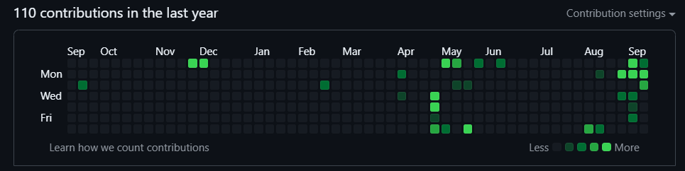

viajar sempre foi o grande sonho da minha vida. trabalhei com turismo por muitos anos: eu planejava e organizava viagens de clientes, fechava hospedagens de luxo, solicitava transfers, indicava restaurantes, buscava por itens raros, montava agendas culturais, arranjava roteiros, comemorações de aniversário e pedidos de casamento, em qualquer lugar do mundo.

tudo isso sem nunca ter nem pisado em um aeroporto. sem nenhuma vivência, tudo que aprendi sobre turismo foi lendo e pesquisando. auxiliava pessoas no check-in, falava com companhias aéreas e montava escalas apenas com as imagens eu tinha na cabeça de como era um aeroporto, o balcão de uma companhia aérea, um avião.

o trabalho era puxado: escala 6x1, resolvendo demandas ao telefone os 7 dias da semana, fossem finais de semana ou feriados, até natal e ano novo eram passados no trabalho. mas eu ficava todas aquelas horas sonhando com o dia em que seria eu a passageira, e aprendendo tudo que podia. consigo falar sobre paris como se tivesse feito um mochilão pela europa depois da faculdade, posso explicar as diferenças entre os parques da disney como se tivesse passado todas as férias escolares em orlando.

andei de avião pela primeira vez em 2016, quando viajei com minha esposa para curitiba. eu imediatamente me apaixonei por tudo - o aeroporto, o embarque, ficar observando os outros aviões decolarem e pousarem pelos grandes janelões da área de embarque, o bom dia para a equipe de bordo e, principalmente, a sensação do avião saindo do chão. eu sempre imaginava como seria sentir o avião decolando - e hoje está entre as minhas sensações preferidas.

depois de muitos anos passando perrengue, finalmente eu e minha esposa nos vimos em uma situação em que poderíamos pagar as contas e pensar em fazer alguma coisa legal - e decidimos fazer nossa primeira viagem internacional no ano passado, meio na loucura. compramos as passagens um mês antes e corremos para planejar tudo. conhecemos a argentina e o uruguai, e foi uma das coisas mais legais que já fizemos na vida.

nos últimos dias, trabalhei bastante neste blog. prova disso é meu gráfico de commits do github, que sempre foi meio largado - mas setembro está ficando já bem verdinho:

além de pequenos ajustes no layout - sempre tem uma coisinha incomodando - também trouxe umas novidades mais substanciais para cá. a mais importante, a que significa mais para mim, e que justifica toda essa introdução emocionada, foi ter [trazido minhas fotos de viagens para cá](/viagens).

eu não sei dizer o quanto essas fotos significam para mim - na verdade, acho que qualquer pessoa que leu aqui pode imaginar. é com muito carinho que inauguro esse cantinho, que espero que um dia esteja lotado de viagens.

além disso, já que esse post é sobre novidades, no plural, aproveito para contar que criei mais algumas páginas novas: 
- [/checklist](/checklist): já que eu penso muito mais rápido do que consigo executar, é importante ter um repositório de ideias para implementar por aqui.
- [/changelog](/changelog): registros de todas as mudanças que vou implementando por aqui.

por hoje é isso :)